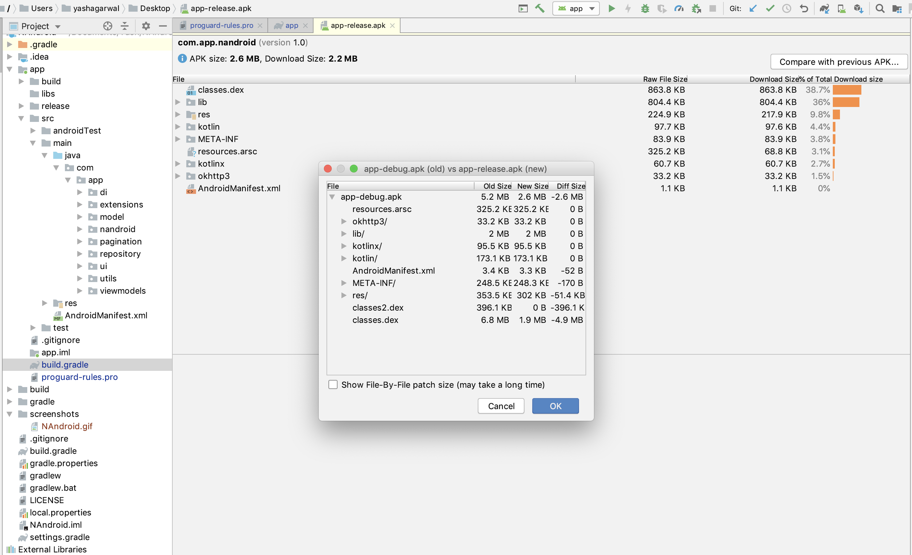

# GithubApp

This application includes the scrollable list of Github Repositories, in which each cell or item represents the Repo name, 
stars,description, language on which repo build and last updated at. And on a click of a particular item it will open the 
detail screen in which repo avatar, name, description, and link to visit the Github Repo on a click of **Visit Github Repo**

# Demo

# Features:
* __MVVM Android Architecture__
* __Dagger2 with Multi Binding Support__
* __Kotlin-Coroutines for api request__
* __Android JetPack Paging for providing Pagination support__
* __Fresco for Image Management__
* __Unit Testing__
* __Any Many More__

Above Feature are used to make code simple, generic, understandable, clean and easily maintainable for the future development.
Especially **Android JetPack Paging Library** is used because this is a kind of application where the user scrolls a lot of 
data to find a suitable Github Repo according to his choice. So in future for the development side, we have to make changes
in **ProjectDataSource** classes only and rest of the code will remain the same. No need to make major changes in ViewModel, 
Adapter and in View classes.

This application supports the screen rotation without losing the data and also use **Constraintlayout** to design layout which 
gives better **UI support for both Mobile and Tablet**, and even when the screen rotates.

I had enabled the **Proguard** along with minifyEnabled and shrinkResources True in released version along with basic support 
for **Android App Bundle**. In the result of that, we can reduce the APK size along with we can also provide an extra security
layer to our code from decompiling or extracting of the code from APK. For more info refer the Image below.

# Prerequisites
* __Android Studio 3.4__
* __Gradle version 3.4.2__
* __Kotlin version 1.3.50__
* __Android Device with USB Debugging Enabled__

# Built With

* __[Android Studio](https://developer.android.com/studio/index.html)__ - The Official IDE for Android
* __[Android JetPack Paging library](https://developer.android.com/topic/libraries/architecture/paging)__ - Android JetPack Paging library
* __[Paging Video for Reference](https://www.youtube.com/watch?v=BE5bsyGGLf4)__ Paging Video for Reference
* __[Gradle](https://gradle.org)__ - Build tool for Android Studio
