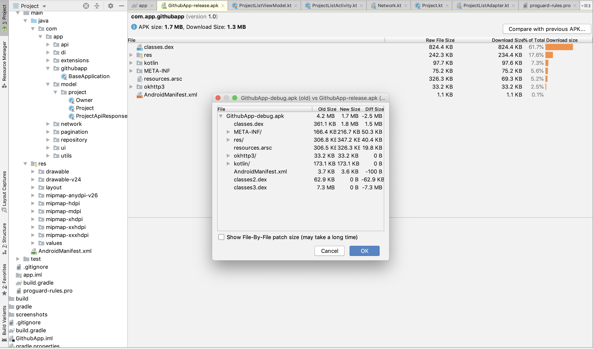
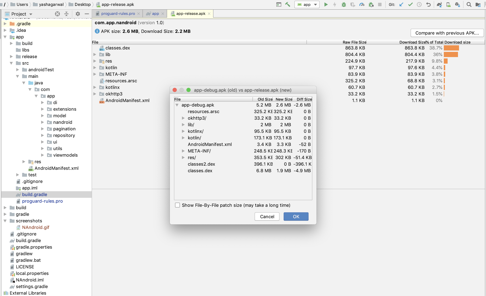

# GithubApp

A small sample app majorily build to learn and test the performance of latest Koin dependency Injection along side with latest
Kotlin Corooutines for network request and Coil(Kotlin-first image loading library).

## Languages, libraries and tools used

* __[Kotlin](https://developer.android.com/kotlin)__
* __[Kotlin Corooutines](https://kotlinlang.org/docs/reference/coroutines-overview.html)__
* __[Koin](https://github.com/InsertKoinIO/koin)__
* __[Coil](https://coil-kt.github.io/coil/getting_started/)__
* __[Moshi](https://github.com/square/moshi)__
* __[Android JetPack Paging](https://developer.android.com/topic/libraries/architecture/paging)__
* __[Android Architecture Components](https://developer.android.com/topic/libraries/architecture/index.html)__
* __[Mockito](http://site.mockito.org/)__

## Future Roadmap Features

* __MVI Architecture__
* __Koin UnitTest__
* __Room with Koin and Kotlin Corooutines__

# Demo

### Koin vs Dagger  

Koin  | Dagger
------------- | -------------
Written in Kotlin  | Written in Java
Errors are fired at runtime  | Errors can be found at compile time
Do not use annotations  | Use annotations
Dedicated library to work with ViewModel (Android Jetpack) | Not interaction with ViewModel

### APK Build with Koin dependency Injection

### APK Build with Dagger2 dependency Injection

### Conclusions

Dagger and Koin are great dependency injection frameworks. Dagger has the advantage of being in the market for a longer time 
than Koin. If you're a Kotlin developer, it will be easier to start with Koin instead of Dagger. Although, Dagger has more 
information in blogs, articles, and questions on Stack Overflow. Finally, Koin is a great alternative for small and medium-
sized apps as Dagger is older and more mature framework when it comes to big projects with a distributed team.

# Prerequisites
* __Android Studio 3.4__
* __Gradle version 3.4.2__
* __Kotlin version 1.3.50__
* __Android Device with USB Debugging Enabled__

# Built With

* __[Android Studio](https://developer.android.com/studio/index.html)__ - The Official IDE for Android
* __[Android JetPack Paging library](https://developer.android.com/topic/libraries/architecture/paging)__ - Android JetPack Paging library
* __[Gradle](https://gradle.org)__ - Build tool for Android Studio

Thanks for reading this repo. Be sure to click ★ below to recommend this repo if you found it helpful. It means a lot to me.

For more about programming, follow me on [Medium](https://medium.com/@yash786agg)

Also, Let’s become friends on [Linkedin](http://bit.ly/24t4EVI)

